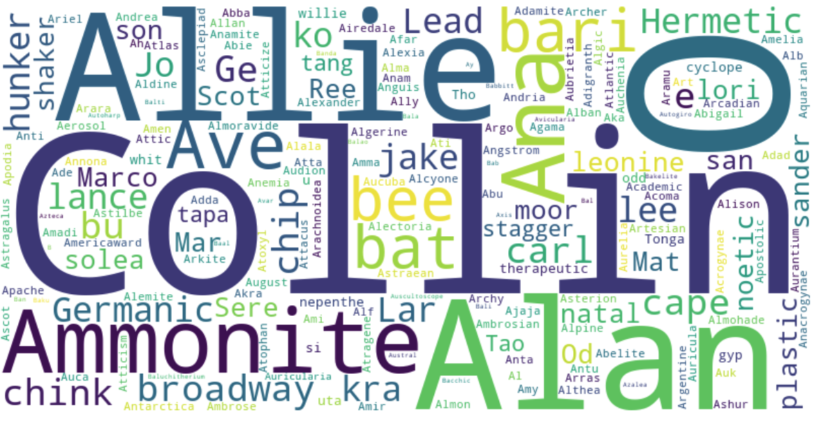

# Text-Search-and-Representation



## Introduction
    This project is a simple text search and representation tool. It is designed to search for a given word in a list of words and return whether the word is present in the list or not. The project also provides a graphical representation of the search results. 

    The focul point of this project is to compare the performance between kd-tree and ball tree both with nearest neighbor search, certain natively developed vectorization methods were alse used and tested for performance comparison.

## Requirements
    The project requires the following libraries to be installed:
    - numpy
    - matplotlib
    - sklearn
    - streamlit
    - gensim (for word2vec)
    - nltk 
    - shelve 
    - mpl.toolkits.mplot3d

    To install the required libraries, run the following command:
    ```
    pip install xxx
    ```


## How to run
    - For the main.py which tested and presented the performace of kd-tree and ball tree, simply run the main.py file.

    - For the chatbot implementation from streamlit, run the following command:
        streamlit run bot_ui.py

## Topics / Aspects covered
    - Text search
    - Text representation
    - Kd-tree
    - Ball tree
    - Nearest neighbor search
    - Vectorization
    - Word2Vec
    - Chatbot (basic)
    
